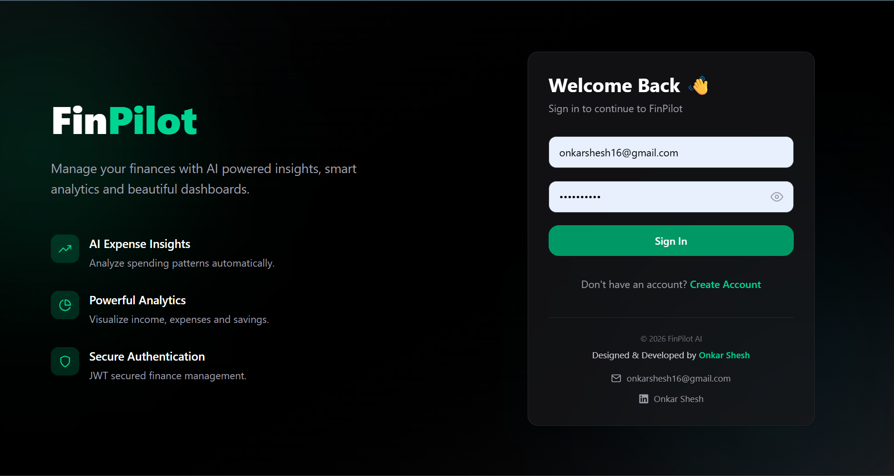
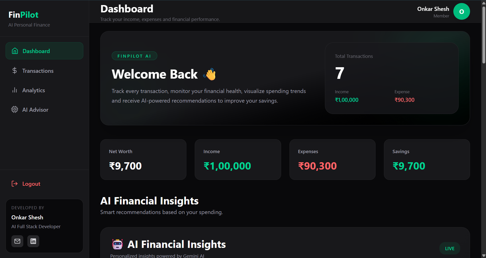
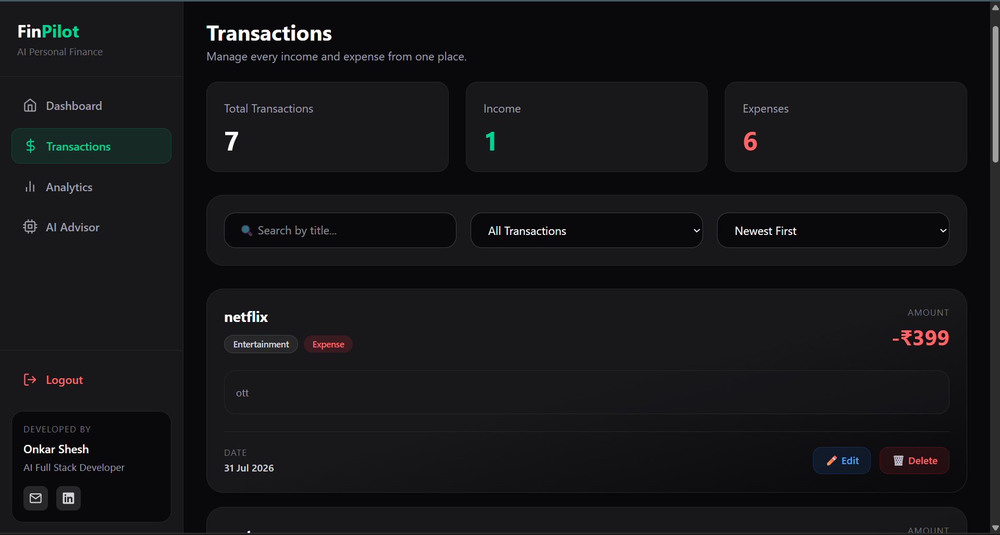
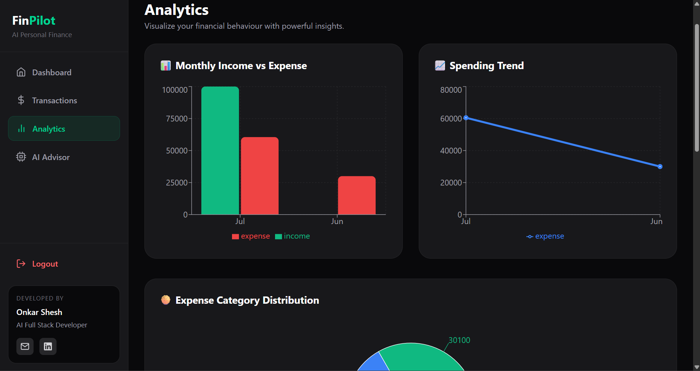
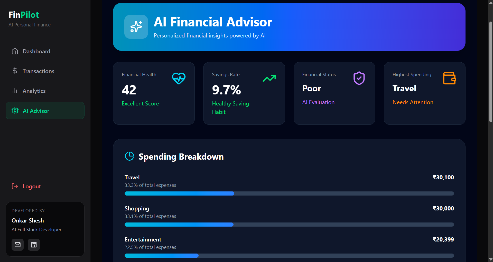

# 💰 FinPilot AI

An AI-powered personal finance platform that enables smarter financial decision-making through intelligent analytics, personalized insights, and interactive dashboards.

---

## 🚀 Features

- 🔐 Secure JWT Authentication
- 💳 Smart Expense & Income Management
- 📊 Interactive Financial Dashboard
- 📈 Spending Analytics & Visualizations
- 🤖 AI-Powered Financial Insights
- 💡 Personalized AI Recommendations
- ⚡ Intelligent Response Caching
- 📱 Fully Responsive UI

---

## 🛠 Tech Stack

**Frontend:** React.js, Tailwind CSS, Axios

**Backend:** Java, Spring Boot, Spring Security, JWT Authentication

**Database:** PostgreSQL

**AI:** Python, FastAPI, Google Gemini API

**Tools:** Docker, Git, GitHub, Maven, Postman

---

## 🏗 Architecture

```text
                React + Tailwind CSS
                       │
                  Axios REST API
                       │
          Spring Boot + Spring Security
              │                     │
         PostgreSQL          FastAPI (AI Service)
                                      │
                               Google Gemini AI
```

---

## 📸 Screenshots

### 🔐 Login


### 📊 Dashboard


### 💳 Transactions


### 📈 Analytics


### 🤖 AI Advisor


---

## 🚀 Getting Started

```bash
git clone https://github.com/OnkarShesh/FinPilot-AI.git
```

Start:

- Frontend → `npm install && npm run dev`
- Backend → `mvn spring-boot:run`
- AI Service → `python app.py`

---

## 🔮 Future Enhancements

- Budget Planning
- Goal-Based Savings
- Financial Reports
- Investment Recommendations

---

## 🤝 Connect With Me

- 🐙 GitHub: https://github.com/OnkarShesh
- 💼 LinkedIn: www.linkedin.com/in/onkarshesh1609
- 📧 Email: Onkarshesh16@gmail.com

⭐ If you like this project, don't forget to leave a star!
